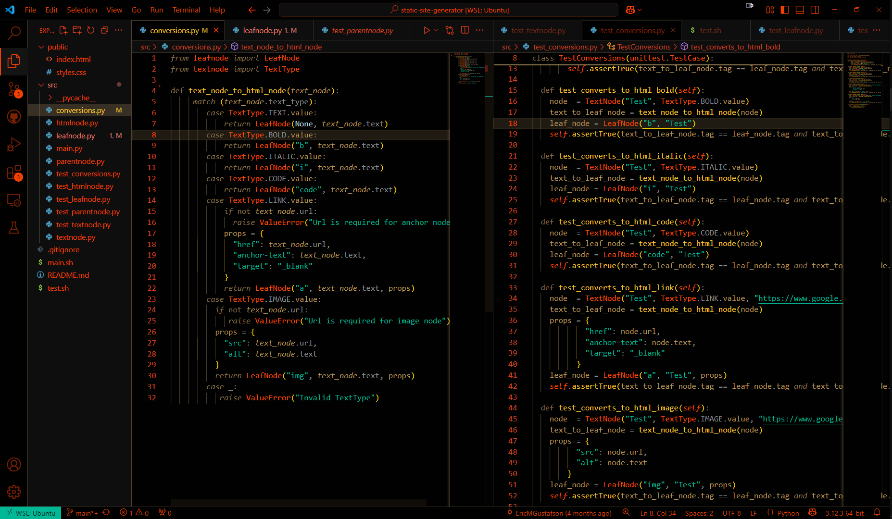
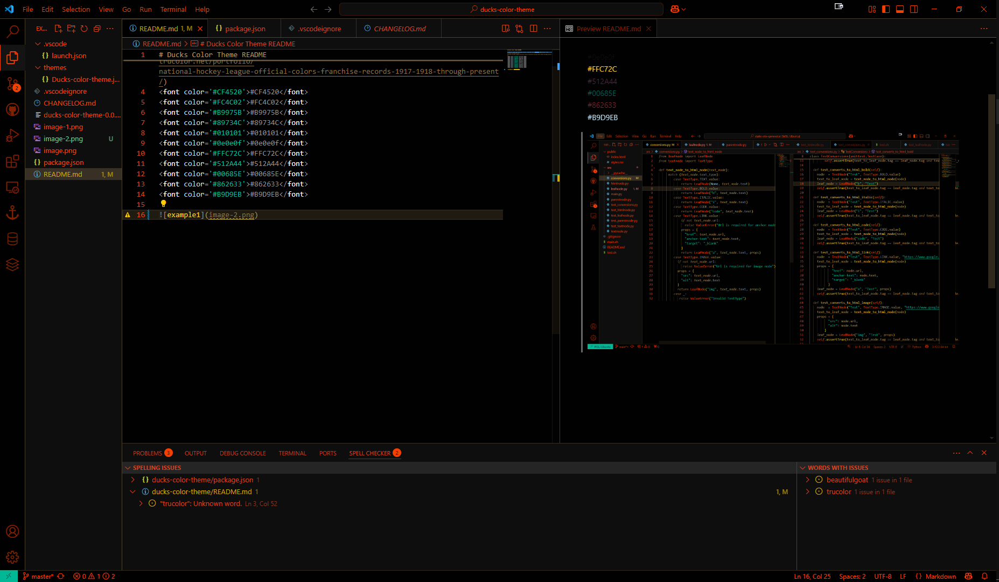

# Ducks Color Theme README

Primarily used the following colors, sourced from [trucolor.net](https://www.trucolor.net/portfolio/national-hockey-league-official-colors-franchise-records-1917-1918-through-present/)  
#CF4520  
#FC4C02  
#B9975B  
#89734C   
#010101  
#0e0e0f  
#FFC72C  
#512A44  
#00685E  
#862633  
#B9D9EB

  

